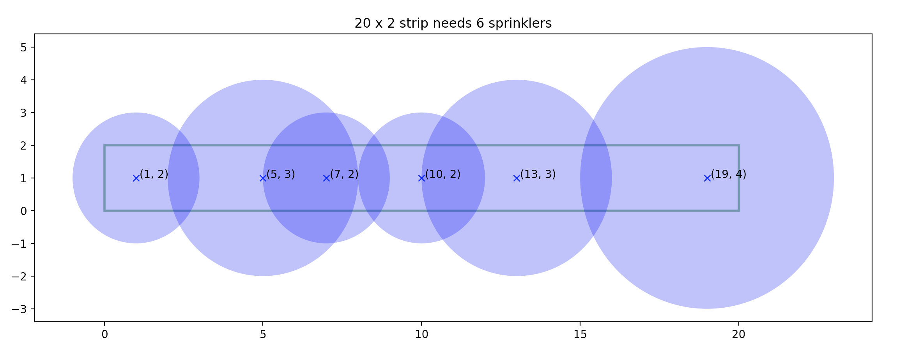

# Watering Grass
- $n$ sprinklers are installed in a horizontal strip of grass $l$ meters long and $w$ meters wide.
- Each sprinkler is installed at the horizontal center line of the strip.
- For each sprinkler we are given its position as the distance from the left end of the center line and its radius of operation.
- What is the minimum number of sprinklers to turn on in order to water the entire strip of grass?
- For each test case output the minimum number of sprinklers needed to water the entire strip of grass.
- If it is impossible to water the entire strip output $-1$.

## Example 

Problem created by Piotr Rudnicki
